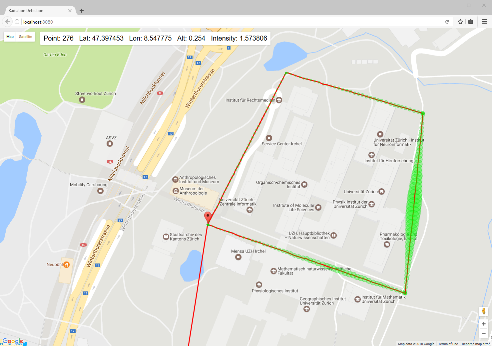
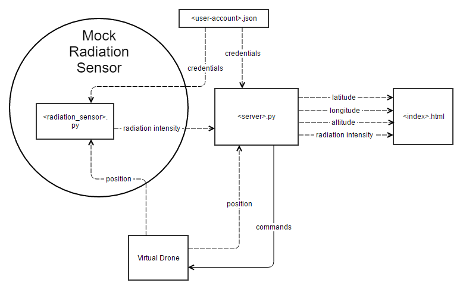

# Radiation Detection Example

This is an example Python app for the Dronesmith API from Dronesmith Technologies. The Dronesmith API is an HTTP requests based API that enables software first drone development. With the Dronesmith API you can test code on virtual drones that are built into the API and then deploy the same code on a real drone. This app uses a virtual drone to accomplish a task in a made up scenario.

<div>
      
</div>


## The Scenario
A deranged physics professor at Zurich University has been performing experiments in various buildings on the North side of the campus. Last night one of his experiments with radioactive materials went terribly wrong and the campus has become radioactive. Now it is up to you and your team to find the location of the failed experiment using a drone equipped with a radiation sensor.

## The App

The app commands a virtual drone to fly in a path around the Zurich University campus while plotting the path on a map.  It also displays the value of radiation intensity at each point along the flight path.

The app in its current form will not find the radiation source. It is up to you modify the app to suit your strategy for finding the building with the radiation source.

<div>

    

</div>

<br/>

The app is composed of 4 files

1. index.html

2. server.py

3. radiation_sensor.py

4. user-account.json

The main workhorse of these files is `server.py`. In this file, a web server that operates on localhost though port 8080 is started. It serves the current position and sensor data of the drone.

The web server periodically retrieves the drone’s position and the intensity value of the drones radiation sensor by sending Dronesmith API requests. In a separate thread from the web server, the drone is instructed to fly in a scripted path around the campus by issuing Dronesmith API requests.

In `index.html` the position and intensity values are periodically retrieved by sending a GET request to [http//:localhost:8080/data](http//:localhost:8080/data). Following each GET request, the drone marker and flight path are updated and a new circle with a radius proportional to radiation intensity is plotted at the latest position using the Google Maps API.

The file `radiation_sensor.py` serves as our mock radiation sensor. This file periodically gets a drones position and calculates a radiation intensity value using the latitude and longitude values. It then updates the intensity field value of the drones radiation sensor. You will need to run this code in a separate terminal before you run the server.py file.

The JSON file `user-account.json` is for storing Dronesmith API credentials.

Also included in the Github project is a setup script, `drone_setup.py`, that you can run to create a virtual drone with a radiation sensor object on your account.

## Prerequisites
To run this app you need a Dronesmith API key. Go to [api.dronesmith.io](http://api.dronesmith.io/) to request an API key. In a few minutes you will receive an email with your key.

You also need a Google Developers API key.
https://developers.google.com/maps/documentation/javascript/get-api-key


## Setup Python

Make sure you are using Python 2.7, not Python 3. Type python --version in the command line to verify your version.

If you're new to using Python, go through these two getting started exercises to set up your developer environment:

http://learnpythonthehardway.org/book/ex0.html

http://learnpythonthehardway.org/book/ex1.html

**Install Python pip module:** https://pip.pypa.io/en/stable/installing/

This should be included by default in latest Python version.

**Install Python requests module:** `pip install requests`

**Install Python geopy module:** `pip install geopy`

If you're on windows, you may need to run python -m pip instead of just pip.


## Running the App
1. **Download or clone the Github project.**

  https://github.com/dronesmith/Radiation-Detection-Example

2. **Add your email and Dronesmith API key to user.json.**

  Leave drone_name field blank.

3. **Add your Google Developers API key to index.html.**

  Find the script with the map.googleapis.com source in the HTML body and add your key to the key field in the URL.
  ```
  <script src="https://maps.googleapis.com/maps/api/js?key=ADD-KEY-HERE&v=3.exp&libraries=visualization&callback=onGoogleReady" async defer></script>
  ```
4. **Run drone_setup.py script.**

  This will create a new virtual drone on your account and add a radiation sensor to it.

5. **Run `python radiation_sensor.py` and leave it running.**

6. **In another terminal run `python server.py`.**

7. **Go to http://localhost:8080**

You should immediately see a Google Maps view. The drone marker will show in about 10 seconds after the page loads. The marker will not move until after the drone has taken off and reached the desired altitude. You should then see the drone take a lap around the campus.


## Helpful Links
* [Dronesmith API Reference](http://readme.dronesmith.io/reference)
* [Using Postman with the Dronesmith API](http://readme.dronesmith.io/docs/tutorial-dronesmith-api)
* [Inverse Square Law](https://www.nde-ed.org/GeneralResources/Formula/RTFormula/InverseSquare/InverseSquareLaw.htm)  
* [Geopy docs](https://geopy.readthedocs.io/en/1.10.0/#data)
* [SimpleHTTPServer docs](https://docs.python.org/2/library/simplehttpserver.html)

<br/>

<div>
  <a href="http://community.dronesmith.io" target="_blank">
    
  </a>
</div>
